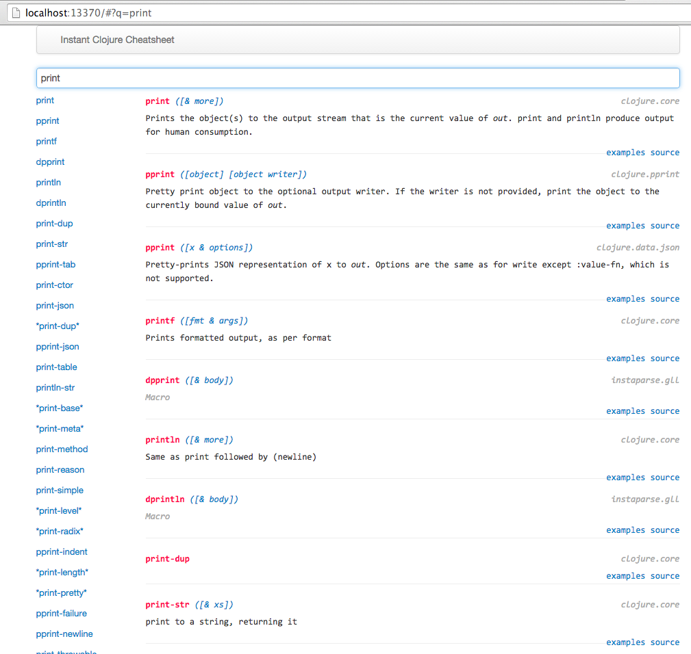

lein-instant-cheatsheet
==========================

[](http://clojars.org/lein-instant-cheatsheet)

[](http://jarkeeper.com/cammsaul/instant-clojure-cheatsheet)

[Instant Cheatsheet][2] instantly creates a cheatsheet for your project and its dependecies.

1.  Add `lein-instant-cheatsheet` to your Leiningen `:plugins`
2.  Start the webserver with `lein instant-cheatsheet`

Instant Cheatsheet spins up a Ring server at `localhost:13370`.

[][2]

[Instant Cheatsheet][2] has a few features that might just make it your go-to Clojure reference:


#### Symbol Filtering ####
Instant Cheatsheet has a built-in filter bar at the top to search for matching symbols. A list of matching symbols and their namespaces appears on the left side of the screen; documentation for those symbols appear on the right.
You can also see documentation in a tooltip by hovering over symbols on the left, and you can see source code (if available) by hovering over the `source` links on the right.
You can also search for examples from [ClojureDocs][8] by clicking the `examples` link.


#### Filtering Based on GET Params ####
Instant Cheatsheet will automatically use the GET parameter `q` as an initial value for the filter bar.
That means a request like `http://localhost:13370/#?q=print` will automatically search for symbols containing `print`.


#### Markdown Support ####

Like [Marginalia][5], Instant Cheatsheet parses docstrs as Markdown. Add examples, links, and more to your documentation!

#### Emacs Keybinding ####

You can create an Emacs function to search Instant Cheatsheet, and even bind it to a keyboard shortcut:
```Lisp
(defun instant-cheatsheet-search (search-term)
  "Opens Instant Cheatsheet in a new browser tab and searches for SEARCH-TERM."
  (interactive "sSearch Instant Cheatsheet for: ")
  (browse-url
   (concat "http://localhost:13370/#?q="
           (url-hexify-string search-term))))

(define-key clojure-mode-map (kbd "<f12> i") #'instant-cheatsheet-search)
(define-key cider-repl-mode-map (kbd "<f12> i") #'instant-cheatsheet-search)
```

Hitting `<f12> i` will prompt you for a search term and open a new browser tab with that term as the initial filter text.


#### About ####

Instant Cheatsheet is inspired by other excellent Clojure cheatsheets like [this one][1].

Instant Cheatsheet was built with [Hiccup][3], [Bootstrap][4], and [AngularJS][6].

[1]: http://jafingerhut.github.io/cheatsheet/clojuredocs/cheatsheet-tiptip-no-cdocs-summary.html
[2]: https://github.com/cammsaul/instant-clojure-cheatsheet
[3]: https://github.com/weavejester/hiccup
[4]: http://twitter.github.io/bootstrap/
[5]: http://fogus.github.io/marginalia/
[6]: https://angularjs.org
[8]: http://clojuredocs.org/
